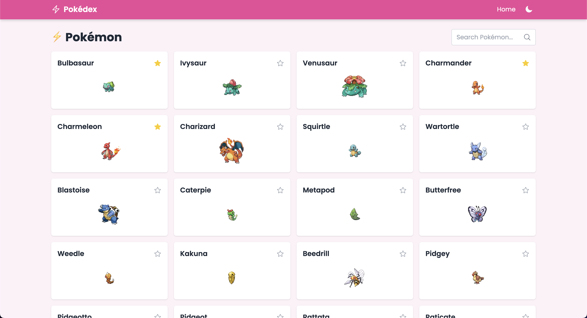

# Pokédex App 🏆✨

_A beautifully designed, feature-rich Pokédex built with Next.js (React), Tailwind CSS, React Query, and PokeAPI._

<p align="center">
  
</p>

<p align="center">
  
  
  
  
  
  
  
  
  
  
  
  
  
  
  
</p>

**Live Web App: [https://pokedex-db.vercel.app/](https://pokedex-db.vercel.app/).** 

Feel free to explore the app and its features! 

---

## 🚀 Features

- **Pokémon List**  
  - Displays all Pokémon in a responsive grid (48 per page).  
  - Client-side pagination with next/previous controls.  
  - Instant search with 200 ms debounce to filter by name.  
- **Items List**  
  - Displays all game items in a similar paginated grid.  
  - Search bar with debounce for item names.  
- **Favorites**  
  - Click the ★ icon on any Pokémon card to toggle favorite.  
  - Favorites are persisted in `localStorage`.  
  - Separate “Favorite Pokémon” section that supports search and pagination.  
- **Animated Transitions**  
  - `framer-motion` layout animations for smooth grid reflows.  
- **Accessible UI**  
  - Keyboard event handlers: Enter to submit, Backspace to delete, letter keys to type.  
  - Heroicons search icon, focus rings, and high-contrast text.  
- **Offline-Friendly**  
  - Core data (all 100 000+ Pokémon & items) is fetched once and cached via React Query.
- **and more!**

---

## 🧰 Tech Stack

- **Next.js** (React + file-based routing)  
- **TypeScript**, **React Query** (`@tanstack/react-query`)  
- **Tailwind CSS** for utility-first styling  
- **Framer Motion** for animations  
- **Heroicons** for SVG icons  
- **PokeAPI** (public REST API for Pokémon data)

---

## 📦 Installation & Local Development

1. **Clone the repo**  
  ```bash
  git clone git@github.com:hoangsonww/The-Pokedex-Database.git
  cd The-Pokedex-Database
  ```

2. **Install dependencies**

  ```bash
  npm install
  # or
  yarn install
  ```
3. **Run the development server**

  ```bash
  npm run dev
  # or
  yarn dev
  ```

Open [http://localhost:3000](http://localhost:3000) in your browser to view the app.

---

## ⚙️ Configuration

*No environment variables are required.*
All data is fetched directly from the PokeAPI.

---

## 📑 API Reference

This app consumes the following PokeAPI endpoints:

### Pokémon

| Method | Endpoint                            | Description                            |
| ------ | ----------------------------------- | -------------------------------------- |
| GET    | `/pokemon?limit=48&offset=<offset>` | Paginated list of Pokémon              |
| GET    | `/pokemon?limit=100000&offset=0`    | Full list (for search/favorites cache) |

### Items

| Method | Endpoint                         | Description                         |
| ------ | -------------------------------- | ----------------------------------- |
| GET    | `/item?limit=48&offset=<offset>` | Paginated list of items             |
| GET    | `/item?limit=100000&offset=0`    | Full item list (for search caching) |

*All responses conform to the PokeAPI schema: count, next, previous, results.*

---

## 📂 Folder Structure

```
/
├── components/
│   ├── PokemonCard.tsx
│   ├── ItemCard.tsx
│   └── Pagination.tsx
├── data/
│   └── models/          # TypeScript interfaces (Pokedex, ItemList)
├── pages/
│   └── index.tsx        # Home page (Pokémon, Items, Favorites)
├── styles/
│   └── globals.css      # Tailwind base styles
├── public/              # Favicons, manifest, images
├── README.md
├── package.json
├── tsconfig.json
└── tailwind.config.js
```

---

## 🤝 Contributing

Contributions welcome! Feel free to open issues or submit pull requests.

1. Fork this repository
2. Create a feature branch (`git checkout -b feature/YourFeature`)
3. Commit your changes (`git commit -m "feat: add your feature"`)
4. Push to your branch (`git push origin feature/YourFeature`)
5. Open a Pull Request

---

## 📜 License

This project is licensed under the MIT License.
